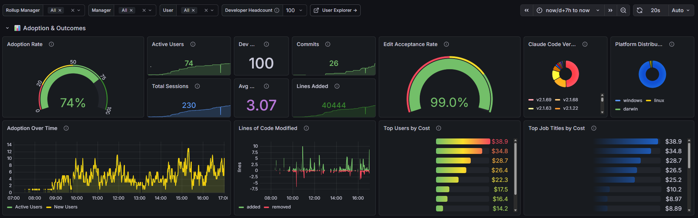

# Claudefana Enterprise

Turn [Claude Code](https://docs.anthropic.com/en/docs/claude-code) telemetry into org-wide adoption dashboards. Track cost per user, slice metrics by department and manager, and correlate AI usage with Jira/Tempo productivity data.

Built on top of [Claudefana](https://github.com/JuanjoFuchs/claudefana) (the core OTEL stack for Claude Code observability).



## What You Get

- **Adoption tracking** — active users, adoption rate, new vs returning users over time
- **Cost attribution** — total spend, cost per user/session/commit, broken down by model
- **Org-level slicing** — filter everything by department, manager, or rollup manager (via Microsoft Graph)
- **Jira/Tempo correlation** — resolved issues, story points, and worklog hours alongside AI metrics
- **Developer scorecard** — full-width table ranking users by cost, output, and productivity
- **Org hierarchy tree** — interactive rollup → manager → user drill-down
- **Per-user deep dive** — drill into any user's sessions, costs, tool usage, and output over time
- **Prometheus alerts** — 10 built-in alerts for usage limits, burn rate, cache efficiency, and exporter health

Two Grafana dashboards with 60+ panels total, 3 cascading filters (`rollup_name` → `manager_name` → `user_email`), and automatic user discovery from Claude Code telemetry.

## Architecture

```
Claude Code ──OTLP──▶ OTEL Collector ──▶ Prometheus ──▶ Grafana
                            │                ▲    ▲
                            ▼                │    │
                          Loki               │    │
                                             │    │
                          graph-enrichment ──┘    │
                          (Microsoft Graph)       │
                                                  │
                          jira-tempo-exporter ─────┘
                          (Jira REST + Tempo API)
```

6 services total. The core 4 come from [claudefana](https://github.com/JuanjoFuchs/claudefana); this repo adds the 2 enterprise exporters and replaces the dashboards.

## Quick Start (Docker Compose)

1. Clone both repos as siblings:
```bash
git clone https://github.com/JuanjoFuchs/claudefana.git
git clone https://github.com/JuanjoFuchs/claudefana-enterprise.git
```

2. Configure credentials:
```bash
cd claudefana-enterprise
cp .env.example .env
# Edit .env with your Jira and Azure AD credentials
```

3. Start everything:
```bash
docker compose -f docker-compose.enterprise.yaml up -d
```

4. Open Grafana at [http://localhost:3000](http://localhost:3000)

Dashboards auto-populate as Claude Code users generate telemetry. The exporters discover users automatically from Prometheus — no user list to maintain.

## Configuration

### Jira / Tempo

| Variable | Description |
|----------|-------------|
| `JIRA_URL` | Your Atlassian instance URL (e.g. `https://your-org.atlassian.net`) |
| `JIRA_API_TOKEN` | API token from [id.atlassian.com](https://id.atlassian.com/manage-profile/security/api-tokens) |
| `STORY_POINTS_FIELD` | Your Jira custom field ID for story points (check your Jira instance) |
| `PROJECT_FILTER` | Optional comma-separated project keys to scope collection |
| `COLLECT_TEAMS` | Set to `true` to collect Tempo team memberships (expensive: 1+N API calls) |

### Microsoft Graph

| Variable | Description |
|----------|-------------|
| `GRAPH_TENANT_ID` | Azure AD tenant ID |
| `GRAPH_CLIENT_ID` | App registration client ID |
| `GRAPH_CLIENT_SECRET` | App registration client secret |

Requires an Azure AD [App Registration](https://portal.azure.com/#view/Microsoft_AAD_RegisteredApps) with **`User.Read.All`** (Application) permission and admin consent.

## Kubernetes Deployment

Kustomize manifests in `k8s/base/` deploy all 6 services to any Kubernetes cluster.

### 1. Build and push exporter images

```bash
docker build -t your-registry/claudefana/jira-tempo-exporter:latest ./jira-tempo-exporter
docker build -t your-registry/claudefana/graph-enrichment-exporter:latest ./graph-enrichment-exporter
docker push your-registry/claudefana/jira-tempo-exporter:latest
docker push your-registry/claudefana/graph-enrichment-exporter:latest
```

### 2. Create secrets

```bash
kubectl create namespace claudefana

kubectl -n claudefana create secret generic claudefana-jira \
  --from-literal=JIRA_URL=https://your-org.atlassian.net \
  --from-literal=JIRA_API_TOKEN=your-token \
  --from-literal=PROJECT_FILTER=

kubectl -n claudefana create secret generic claudefana-graph \
  --from-literal=AZURE_TENANT_ID=your-tenant-id \
  --from-literal=AZURE_CLIENT_ID=your-client-id \
  --from-literal=AZURE_CLIENT_SECRET=your-secret
```

### 3. Customize and deploy

Edit `k8s/base/deployments.yaml`:
- Replace `your-registry/` with your container registry URL
- Set `STORY_POINTS_FIELD` to match your Jira instance

Optionally uncomment `storageClassName` in `k8s/base/pvcs.yaml` to match your cluster.

```bash
kubectl apply -k k8s/base/
```

### Ingress

An example ingress (AWS ALB) is provided at `k8s/base/ingresses.yaml.example`. Copy it to a Kustomize overlay and customize for your ingress controller and hostnames.

### Kustomize Overlays

For org-specific configuration (SSO, real hostnames, registry URLs), create an overlay:

```
k8s/
├── base/                    # Generic manifests (this repo)
└── overlays/
    └── your-org/            # Your private overlay
        ├── kustomization.yaml
        ├── ingresses.yaml   # Real hostnames
        └── patches/
            └── grafana-sso.yaml  # Azure AD OAuth patch
```

## How It Works

Both exporters query Prometheus to discover which users have Claude Code telemetry, then fetch external data only for those users. No user lists to configure — adoption grows automatically.

- **Graph Enrichment** — resolves each user's department, job title, manager, and rollup manager (CxO direct report) from Microsoft Graph. Exports a `user_info` gauge that acts as a label bridge for PromQL joins.
- **Jira/Tempo** — pulls resolved/created issues, story points, and Tempo worklogs scoped to Claude Code users. Enables cost-per-ticket and AI-time-vs-billable-time analysis.

All org-level dashboard queries use the same PromQL pattern:

```promql
sum by (department)(
    claude_code_cost_usage_USD_total
    * on(user_email) group_left(department)
    user_info{rollup_name=~"$rollup_name"}
)
```

## Requirements

- [Claudefana](https://github.com/JuanjoFuchs/claudefana) core stack (cloned as sibling directory)
- Docker Compose or Kubernetes cluster
- Jira Cloud/Server + Tempo (for Jira/Tempo exporter)
- Azure AD with App Registration (for Graph enrichment)
- Grafana plugin: [`equansdatahub-tree-panel`](https://grafana.com/grafana/plugins/equansdatahub-tree-panel/) (auto-installed in K8s; manual for Docker Compose)

## License

MIT
